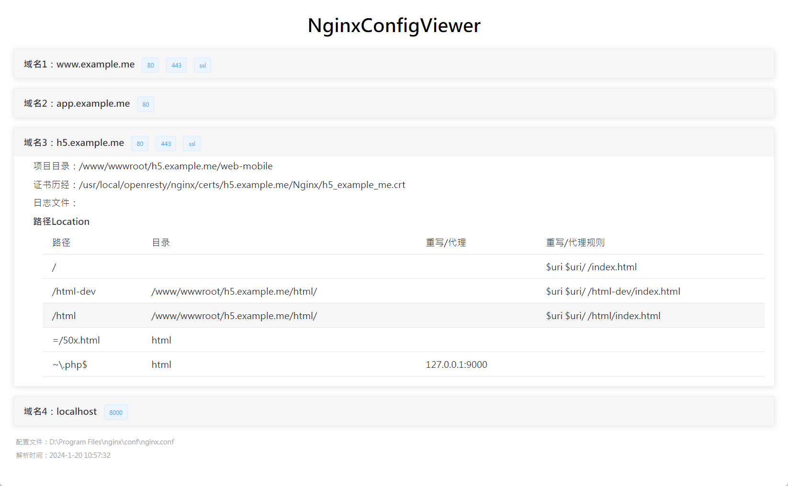

# nginx配置查看工具


## 编译&启动
```code
git clone git@github.com:lixiang4u/nginx-view.git
cd nginx-view
go get
go build .
./nginx-view  /usr/local/nginx/conf/nginx.conf
```

## 运行截图


## 说明
> 不支持复杂语法，例如 ```if``` 块等
 